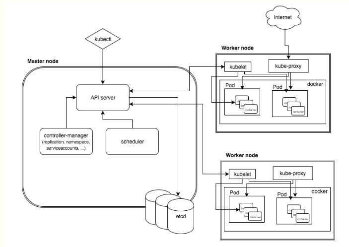
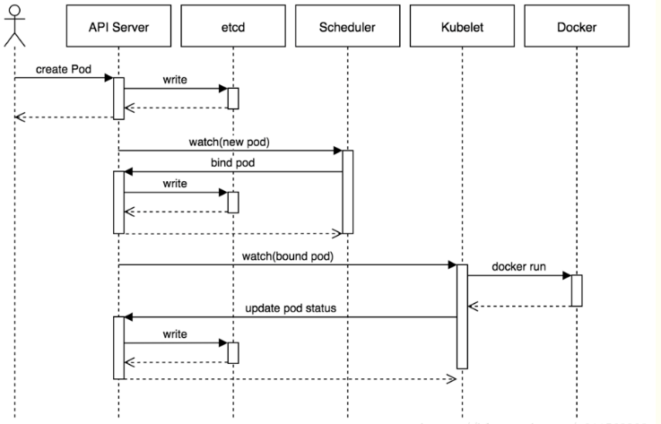

#### 基本概念

1. k8s是什么？

   k8s,kubernetes 是一个可移植的，可扩展的开源平台，用于管理容器化的工作负载和服务，方便了声明式配置和自动话。它拥有一个庞大且快速增长的生态系统。k8s的服务支持和工具广泛应用。

2. k8s组件

   k8s集群由代表控制平面的组件和一组成为节点的机器组成。

3. k8s API

   k8s的api使你可以查询和操作k8s中对象的状态，k8s控制平面的核心是api服务和它暴露的http api。用户、集群的不同部分以及外部组件都通过api服务相互通信。

#### k8s发展过程

1. 传统部署时代

   单个物理机上运行多个应用程序，有可能出现某个应用程序占用大部分资源的情况，结果导致其他应用程序的性能下降。一种解决方案就是在不同物理机上运行每个应用程序，但是由于资源利用不足而无法扩展，并且组织维护多台物理机的成本也很高。

2. 虚拟化部署时代

   作为解决传统部署时代问题的解决方案，引入了虚拟化。虚拟化技术允许在单个物理机的cpu上运行多个虚拟机（VM），虚拟化允许应用程序在VM之间隔离，并提供一定程度的安全，因为一个应用程序的信息不能被另一应用程序随便访问。

   虚拟化技术能够更好的利用物理资源，用因为可轻松添加或者更新应用而实现了更好的可伸缩性，降低硬件成本

   每个VM是一台完整的计算机，在虚拟化硬件之上运行所有组件，包括自己的操作系统。

3. 容器部署时代

   容器类似VM，但是他们既有被放宽的隔离属性，可以在应用程序之间共享操作系统，因此，容器被认为是轻量级的。容器和VM类似，具有自己的文件系统，cpu，内存，进程空间等。由于他们与基础架构分离，因此可以跨云和OS发行版本进行移植。

#### k8s提供的功能

1. 服务发现和负载均衡
2. 存储编排
3. 自动部署和回滚
4. 自动完成装箱计算
5. 自我修复
6. 密钥与配置管理

##### 注意：

1. 不限制支持的应用程序类型
2. 不部署源代码，也不构建你的应用程序
3. 不提供应用程序级别的服务作为内置服务
4. 不要求日志记录、监控或者报警解决方案
5. 不提供或不要求配置语言、系统
6. 不提供也不采用任何全面的机器配置、维护、管理或者自我修复系统

#### k8s的组成



k8s属于主从分布式架构，主要由Master node和Worker node组成，以及包括客户端命令行工具kubectl和其他附加项。

Master Node:作为控制节点，对集群进行调度管理；master node由API Server,Cluster State Store和Contriller-Manager Server所组成

```
1. API Server：提供了统一的资源操作入口，提供认证、授权、访问控制、API注册和 发现等机制。

2. Scheduler：负责资源调度，按照预定的调度策略将Pod调度到相应的节点上。

3. Cluster State Store：保存了整个集群的状态，默认使用Etcd。

4. Controller-Manger Server：负责维护集群的状态，比如故障检测、自动扩展、滚动更新等；
```

Worker Node:作为真正的工作节点，运行业务应用的容器；Worker Node包含kubelet,kube proxy和Container Runtime

```
1． kubelet：维护容器的生命周期，并管理CSI（Container Storage Interface）和CNI（Conteinre Network Interface）

2． kube-proxy：基于一种公共访问策略（例如：负载均衡），提供访问pod的途径；

3． Container runtime：负责镜像管理以及Pod和容器的真正运行，如:docker；
```

kubectl： Kubernetes集群的命令行接口,用于通过命令行与API Server进行交互，实现在集群中进行各种资源的维护与管理操作；

Add-on：对Kubernetes核心功能的扩展，主要有网络、服务发现和可视化这三大类的附加项。

repliceation : 用于伸缩副本数量

endpoint : 用于管理网络请求

#### 创建pod的时序图



1. 用户提交创建Pod的请求，可以通过API Server的REST API ，也可用Kubectl命令行工具，支持Json和Yaml两种格式；
2. API Server 处理用户请求，存储Pod数据到Etcd；
3. Schedule通过和 API Server的watch机制，查看到新的pod，尝试为Pod绑定Node；
4. 过滤主机：调度器用一组规则过滤掉不符合要求的主机，比如Pod指定了所需要的资源，那么就要过滤掉资源不够的主机；
5. 主机打分：对第一步筛选出的符合要求的主机进行打分，在主机打分阶段，调度器会考虑一些整体优化策略，比如把一个Replication Controller的副本分布到不同的主机上，使用最低负载的主机等；
6. 选择主机：选择打分最高的主机，进行binding操作，结果存储到Etcd中；
7. kubelet根据调度结果执行Pod创建操作： 绑定成功后，会启动container, docker run, scheduler会调用API Server的API在etcd中创建一个bound pod对象，描述在一个工作节点上绑定运行的所有pod信息。运行在每个工作节点上的kubelet也会定期与etcd同步bound pod信息，一旦发现应该在该工作节点上运行的bound pod对象没有更新，则调用Docker API创建并启动pod内的容器。